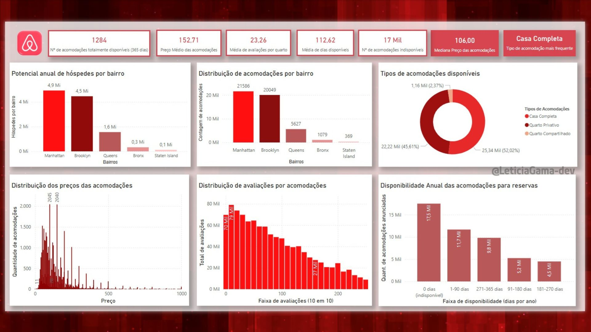
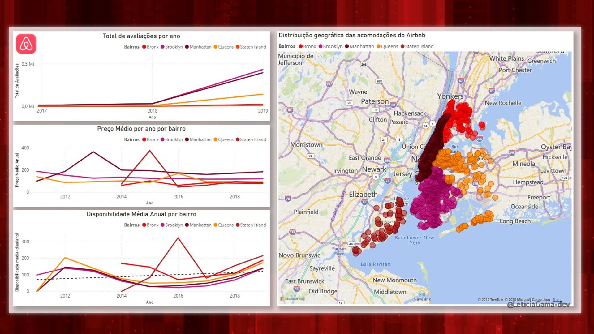

# Rota-02-BI
Projeto de Business Intelligence da Laboratória - análise, storytelling e dashboard Airbnb
---
## Descrição do Projeto
O projeto **Rota 02 – BI** teve como objetivo aplicar conceitos de **Business Intelligence (Inteligência de Negócios)** para transformar dados em **insights estratégicos** e visuais interativos.  
Exploramos dados do **Airbnb** para construir um painel (**dashboard**) completo com **Data Storytelling**, permitindo compreender melhor a distribuição e o comportamento dos quartos disponíveis.

O projeto foca em:

- Processamento e preparação das bases de dados
- Criação de relações entre tabelas
- Desenvolvimento de novas variáveis e medidas com DAX
- Construção de dashboards interativos com narrativa de dados

---
## Contexto e Problema de Negócio

Com a ascensão de plataformas como o Airbnb, maximizar a eficiência e a rentabilidade tornou-se crucial para anfitriões e para a própria plataforma. A enorme quantidade de dados gerados (imóveis, preços, localizações, feedback) oferece uma oportunidade única para a aplicação de Business Intelligence (BI).

Este projeto atua sobre esse desafio, usando o BI para transformar dados brutos em decisões estratégicas.

O objetivo de negócio é responder às seguintes perguntas:

   - Quais padrões de disponibilidade, preço e avaliação podem ser identificados?
   - Existem tendências ou fatores (como localizaçãoe tipo do imóvel) que influenciam diretamente a ocupação e a receita?
   - Como podemos usar estes insights para otimizar a receita e melhorar a eficiência operacional dos anfitriões?

  
  ---

## Objetivos

- Garantir **consistência e integridade dos dados**
- Relacionar tabelas e criar colunas calculadas
- Aplicar fórmulas DAX para métricas estratégicas
- Explorar dados com análises descritivas, tendências e distribuição
- Construir dashboards claros e interativos
- Aplicar **Data Storytelling** para tomada de decisão

---

## Tecnologias e Ferramentas Utilizadas

- **Plataformas:** Power BI, BigQuery  
- **Linguagens:** DAX, SQL (BigQuery) 
- **Insumos:** Bases de dados do Airbnb  

## Passos do Projeto

### 1️⃣ Processar e Preparar a Base de Dados
- Verificar e alterar tipos de dados das variáveis
- Relacionar tabelas no Power BI
- Criar novas colunas calculadas

### 2️⃣ Utilizar Fórmulas DAX
- Criar colunas e medidas estratégicas
- Calcular métricas de ocupação e disponibilidade
- Explorar a diferença entre medidas, colunas e parâmetros

### 3️⃣ Análise Exploratória de Dados
- Agrupar dados por variáveis categóricas
- Visualizar distribuições e tendências
- Aplicar medidas de tendência central e dispersão

### 4️⃣ Dashboard e Data Storytelling
- Construir painel completo com gráficos e mapas
- Aplicar narrativa de dados para insights claros
- Apresentar recomendações estratégicas

### Dashboards Criados



#### Página 1
- Gráficos incluídos:
  - Potencial anual de hóspedes por bairro
  - Distribuição de acomodações por bairro
  - Tipos de acomodações disponíveis
  - Distribuição dos preços das acomodações
  - Distribuição de avaliações por acomodações
  - Disponibilidade anual das acomodações



#### Página 2
- Gráficos incluídos:
  - Total de avaliações por ano
  - Preço médio por ano por bairro
  - Disponibilidade média anual por bairro
  - Distribuição geográfica das acomodações

##  Principais Insights e Conclusões


A análise da base de dados permitiu extrair os seguintes resultados e recomendações estratégicas:

#### Resultados Principais

* **Tipo de Quarto:** A "Casa Completa" é o tipo de acomodação mais popular, representando mais de 52% da oferta, seguida por "Quarto Privativo".
* **Preço e Disponibilidade:** A mediana de preço por acomodação é de $152.714, com a maior parte dos anúncios abaixo de $250. A disponibilidade anual apresentou tendência de aumento entre 2018 e 2019.
* **Distribuição:** A maior concentração de aluguéis está em **Manhattan e Brooklyn**, que funcionam como os principais centros de atividade do Airbnb em NY.
* **Crescimento:** O número de avaliações e a disponibilidade cresceram significativamente de 2017 a 2019, indicando que a plataforma está em plena expansão.

#### Recomendações Estratégicas

1.  **Foco nos Mercados Principais:** Anfitriões devem concentrar esforços de marketing e gestão em **Brooklyn e Manhattan**, pois são as áreas com maior demanda e oferta, visando maximizar os lucros.
2.  **Exploração de Oportunidades:** Bairros como **Queens e Staten Island** são mercados menos explorados, com menor competição e potencial de crescimento.
3.  **Diferenciação Competitiva:** Para justificar preços mais elevados, anfitriões devem se diferenciar através de serviços adicionais, comodidades, experiências personalizadas e avaliações de alta qualidade.
4.  **Melhoria na Coleta de Dados:** Foi observada inconsistência nos dados (erros de preenchimento). Recomenda-se uma melhor padronização dos questionários para melhorar a qualidade da base de dados.
5.  **Gestão de Anúncios:** Anúncios indisponíveis devem ser verificados, pois podem indicar anfitriões desengajados ou iniciantes que necessitam de treinamento.


### Medidas DAX Utilizadas

1.  **Potencial Anual de Hóspedes por Bairro**
    * **O que faz:** Calcula o número total de hóspedes por ano em cada bairro.
    ```dax
    Potencial Anual de Hóspedes = SUM(Tabela[Hóspedes])
    ```

2.  **Distribuição de Acomodações por Bairro**
    * **O que faz:** Conta o número total de acomodações disponíveis em cada bairro.
    ```dax
    Acomodações por Bairro = COUNTROWS(Tabela)
    ```

3.  **Tipos de Acomodações Disponíveis**
    * **O que faz:** Calcula a proporção percentual de cada tipo de acomodação (Casa Completa, Quarto Privativo, Quarto Compartilhado).
    ```dax
    % Casa Completa = DIVIDE(COUNTROWS(FILTER(Tabela, Tabela[Tipo] = "Casa Completa")), COUNTROWS(Tabela))
    ```

4.  **Distribuição dos Preços das Acomodações**
    * **O que faz:** Organiza as acomodações em faixas de preço, mostrando quantas se enquadram em cada faixa.
    ```dax
    Faixa de Preço = SWITCH(TRUE(),
        Tabela[Preço] <= 50, "Até 50",
        Tabela[Preço] <= 100, "51 a 100",
        Tabela[Preço] <= 150, "101 a 150",
        "Acima de 150"
    )
    ```

5.  **Distribuição de Avaliações por Acomodações**
    * **O que faz:** Conta a quantidade de acomodações com base no número de avaliações.
    ```dax
    Avaliações por Acomodações = COUNTROWS(FILTER(Tabela, Tabela[Avaliações] > 0))
    ```

6.  **Disponibilidade Anual das Acomodações**
    * **O que faz:** Classifica as acomodações de acordo com sua disponibilidade anual em dias.
    ```dax
    Faixa de Disponibilidade = SWITCH(TRUE(),
        Tabela[Disponibilidade] <= 30, "Até 30 dias",
        Tabela[Disponibilidade] <= 60, "31 a 60 dias",
        Tabela[Disponibilidade] <= 90, "61 a 90 dias",
        "Acima de 90 dias"
    )
    ```

## Como Rodar o Projeto

1. Abrir o Power BI Desktop versão 2.148.878.0 (64-bit, outubro de 2025)
2. Conectar às bases de dados do Airbnb (BigQuery ou CSVs)
3. Criar relações entre tabelas
4. Aplicar fórmulas DAX conforme definido no projeto
5. Construir visualizações e dashboards interativos
6. Explorar insights utilizando Data Storytelling
###  Observação
- Dados utilizados são fictícios e foram criados para fins de demonstração


## Autor
**Leticia Gama de Souza**  
[LinkedIn](https://www.linkedin.com/in/leticia-gama-code) | [GitHub](https://github.com/LeticiaGama-dev)

